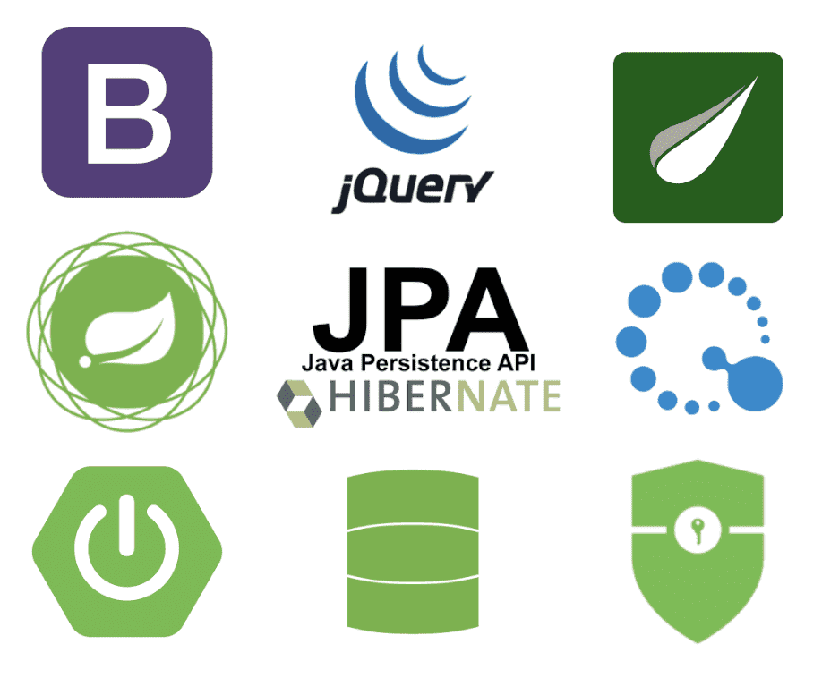
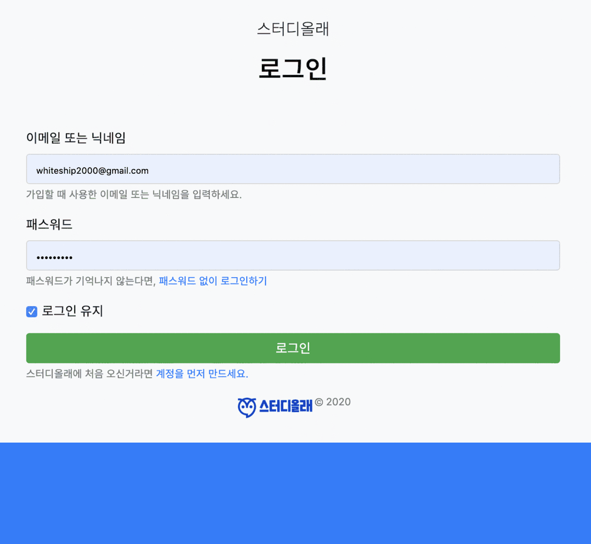

# spring-studyolle

스터디를 만들고 모임을 관리하는 웹 애플리케이션

### 개발환경

프로젝트 개발 환경은 다음과 같습니다.

* IDE : IntelliJ IDEA Ultimate
* Git Tools : Source Tree
* OS : Windows10
* SpringBoot 2.2.4
* Java11
* Maven

</img> 

- 해당 repo는 [스프링과 JPA 기반 웹 애플리케이션 개발 - 백기선](https://www.inflearn.com/course/%EC%8A%A4%ED%94%84%EB%A7%81-JPA-%EC%9B%B9%EC%95%B1) 해당 강의를 듣고 정리한 REPO 입니다.

### 구조

</img> 
